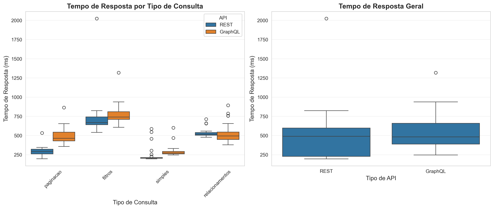
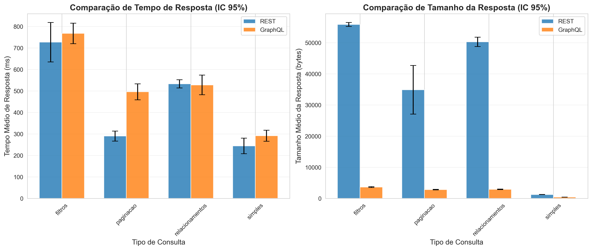
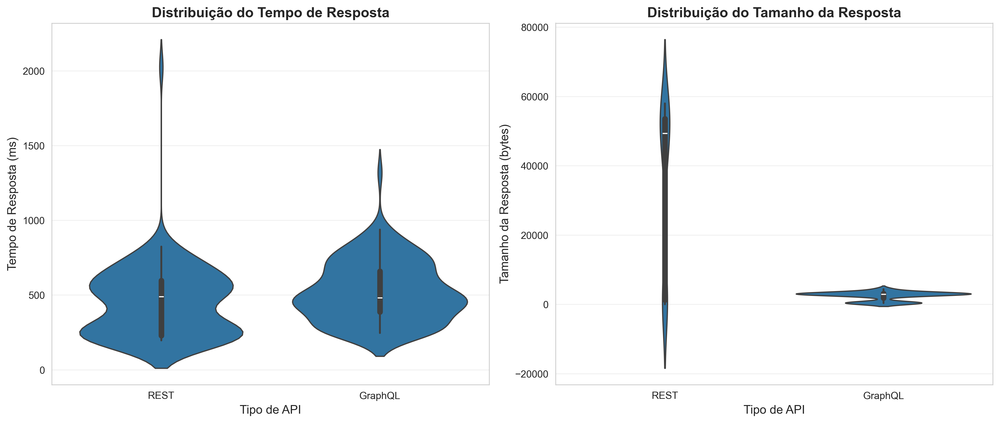

# 📝 Experimento Controlado: GraphQL vs REST

## 1. Informações do grupo

- **🎓 Curso:** Engenharia de Software
- **📘 Disciplina:** Laboratório de Experimentação de Software
- **🗓 Período:** 6° Período
- **👨‍🏫 Professor(a):** Prof. Dr. João Paulo Carneiro Aramuni
- **👥 Membros do Grupo:** Gabriel Lourenço, Gabriel Matos, Larissa Pedrosa e Paula de Freitas

---

## 2. Introdução

Este laboratório implementa um **experimento controlado** para avaliar quantitativamente os benefícios da adoção de uma API GraphQL em comparação com uma API REST.

O objetivo é realizar medições sistemáticas de **tempo de resposta** e **tamanho de payload** em diferentes cenários de consulta (simples, com relacionamentos, com filtros e com paginação) para comparar as duas abordagens de API.

Espera-se compreender se GraphQL oferece vantagens mensuráveis em termos de **desempenho** e **eficiência de transferência de dados** quando comparado ao modelo tradicional REST.

### 2.1. Questões de Pesquisa (Research Questions – RQs)

As **Questões de Pesquisa** foram definidas para guiar a investigação e estruturar a análise dos dados coletados:

**🔍 Questões de Pesquisa - Research Questions (RQs):**

| RQ   | Pergunta                                                                             |
| ---- | ------------------------------------------------------------------------------------ |
| RQ01 | Respostas às consultas GraphQL são mais rápidas que respostas às consultas REST? |
| RQ02 | Respostas às consultas GraphQL têm tamanho menor que respostas às consultas REST? |

### 2.2. Hipóteses Informais (Informal Hypotheses – IH)

As **Hipóteses Informais** foram elaboradas a partir das RQs, estabelecendo expectativas sobre os resultados esperados do estudo:

**💡 Hipóteses Informais - Informal Hypotheses (IH):**

| IH   | Descrição                                                                                                                                                                   |
| ---- | ----------------------------------------------------------------------------------------------------------------------------------------------------------------------------- |
| IH01 | GraphQL apresenta tempo de resposta menor que REST em consultas com múltiplos relacionamentos, devido à capacidade de buscar dados relacionados em uma única requisição. |
| IH02 | GraphQL retorna payloads menores que REST em média, pois permite selecionar apenas os campos necessários, evitando over-fetching.                                           |
| IH03 | REST apresenta melhor desempenho em consultas simples e diretas, onde não há necessidade de resolver múltiplos relacionamentos.                                            |
| IH04 | GraphQL demonstra maior vantagem em cenários com paginação, reduzindo o número de requisições necessárias.                                                             |
| IH05 | A diferença de tamanho de payload entre GraphQL e REST é mais significativa em consultas que envolvem múltiplas entidades relacionadas.                                    |

---

## 3. Tecnologias e ferramentas utilizadas

- **💻 Linguagem de Programação:** Python 3.9+
- **🛠 Frameworks/Bibliotecas:**
  - `requests` - Cliente HTTP para REST e GraphQL
  - `pandas` - Manipulação e análise de dados
  - `scipy/statsmodels` - Análise estatística
  - `matplotlib/seaborn` - Visualização de dados
  - `python-dotenv` - Gerenciamento de variáveis de ambiente
- **🌐 APIs utilizadas:**
  - GitHub REST API v3 ([https://api.github.com](https://api.github.com))
  - GitHub GraphQL API v4 ([https://api.github.com/graphql](https://api.github.com/graphql))
- **📊 Ferramentas de Visualização:**
  - Power BI Desktop - Dashboard interativo
  - Matplotlib/Seaborn - Gráficos estatísticos
- **📦 Dependências:** Listadas em `requirements.txt`

---

## 4. Metodologia

### 4.1 Tipo de Experimento

Este é um **experimento controlado fatorial completo 2×4**:

- **2 níveis de API:** REST vs GraphQL
- **4 níveis de tipo de consulta:** simples, relacionamentos, filtros, paginação
- **30 repetições** por combinação
- **Total:** 240 medições

### 4.2 Variáveis do Experimento

**Variáveis Independentes (fatores controlados):**

- **Tipo de API:** REST ou GraphQL
- **Tipo de consulta:** simples, com relacionamentos, com filtros, com paginação

**Variáveis Dependentes (métricas medidas):**

- **Tempo de resposta (ms):** Latência total da requisição HTTP
- **Tamanho da resposta (bytes):** Tamanho do payload JSON retornado

**Variáveis de Controle:**

- Mesma API base (GitHub API)
- Mesmo token de autenticação
- Mesmos parâmetros de consulta (usuário, repositório, filtros)
- Intervalo fixo entre requisições (1 segundo) para evitar rate limiting

### 4.3 Tratamentos

O experimento avalia **8 tratamentos** distintos:

| Tratamento | Tipo de API | Tipo de Consulta | Descrição                           |
| ---------- | ----------- | ---------------- | ------------------------------------- |
| T1         | REST        | Simples          | Consulta básica de dados de usuário |
| T2         | GraphQL     | Simples          | Consulta básica de dados de usuário |
| T3         | REST        | Relacionamentos  | Consulta de usuário + repositórios  |
| T4         | GraphQL     | Relacionamentos  | Consulta de usuário + repositórios  |
| T5         | REST        | Filtros          | Consulta de repositórios com filtros |
| T6         | GraphQL     | Filtros          | Consulta de repositórios com filtros |
| T7         | REST        | Paginação      | Consulta paginada de issues           |
| T8         | GraphQL     | Paginação      | Consulta paginada de issues           |

### 4.4 Coleta de dados

- A coleta foi realizada utilizando as **GitHub REST API v3** e **GitHub GraphQL API v4**, que fornecem acesso estruturado a metadados de repositórios e usuários.
- Foram implementados dois clientes especializados:
  - **`rest_client.py`** - Cliente para consultas REST
  - **`graphql_client.py`** - Cliente para consultas GraphQL
- Cada cliente executa 4 tipos de consulta (simples, relacionamentos, filtros, paginação)
- **Autenticação:** Token de acesso pessoal do GitHub (configurado via arquivo `.env`)
- **Randomização:** A ordem de execução dos tratamentos é randomizada para evitar viés temporal

### 4.5 Configuração do Ambiente

**Pré-requisitos:**

- Python 3.9 ou superior
- Conta no GitHub
- Token de acesso pessoal do GitHub

**Instalação:**

```bash

# Navegue até o diretório do projeto

cdcontrolled-exp


# Instale as dependências

pipinstall-rrequirements.txt

```

**Configuração do Token GitHub:**

1. Acesse: [https://github.com/settings/tokens](https://github.com/settings/tokens)
2. Clique em **"Generate new token (classic)"**
3. Dê um nome descritivo (ex: "Experimento Lab05")
4. Selecione as seguintes permissões:
   - ✓ `public_repo` (acesso a repositórios públicos)
   - ✓ `read:user` (leitura de perfil de usuário)
5. Clique em **"Generate token"**
6. **COPIE O TOKEN** (você não poderá vê-lo novamente!)

**Crie um arquivo `.env`:**

```env
GITHUB_TOKEN=seu_token_aqui
```

### 4.6 Execução do Experimento

**Teste dos Clientes Individuais:**

```bash
# Teste do Cliente REST
python rest_client.py

# Teste do Cliente GraphQL
python graphql_client.py
```

**Execução do Experimento Completo:**

```bash
python experiment.py
```

O script `experiment.py`:

1. Carrega o token de autenticação
2. Executa 8 tratamentos diferentes (4 tipos de consulta × 2 tipos de API)
3. Realiza 30 repetições de cada tratamento (total de 240 medições)
4. Randomiza a ordem de execução para evitar viés
5. Registra timestamp, tipo de API, tipo de consulta, tempo de resposta e tamanho do payload
6. Salva os resultados em formato CSV, JSON e sumário em texto

⏱ **Tempo estimado:** Aproximadamente 4-5 minutos (com intervalo de 1s entre requisições para evitar rate limiting)

### 4.7 Estrutura dos Dados Coletados

Cada medição contém os seguintes campos:

```json
{
  "timestamp": "2025-11-30T10:30:45.123456",
  "api_type": "REST",
  "query_type": "simples",
  "query_name": "get_user",
  "response_time_ms": 245.67,
  "response_size_bytes": 1234,
  "success": true,
  "error_msg": null
}
```

### 4.8 Métricas

#### 📊 Métricas do Experimento - Experiment Metrics (EM)

| Código | Métrica                       | Descrição                                                   |
| ------- | ------------------------------ | ------------------------------------------------------------- |
| EM01    | ⏱ Tempo de Resposta (ms)      | Latência total da requisição HTTP, medida em milissegundos |
| EM02    | 📦 Tamanho da Resposta (bytes) | Tamanho do payload JSON retornado pela API, medido em bytes   |

| EM03    | ✅ Taxa de Sucesso (%)         | Percentual de requisições bem-sucedidas sem erros                     |

| EM04    | 🔄 Tipo de API                 | Categoria da API utilizada: REST ou GraphQL                             |

| EM05    | 📋 Tipo de Consulta            | Categoria da consulta: simples, relacionamentos, filtros ou paginação |

### 4.9 Cálculo de métricas

-**Tempo de Resposta (EM01):** Calculado usando `time.time()` antes e depois de cada requisição HTTP

-**Tamanho da Resposta (EM02):** Obtido através do método `len(response.text.encode('utf-8'))`

-**Taxa de Sucesso (EM03):** Razão entre requisições com `status_code == 200` e total de requisições

- As métricas são calculadas para cada uma das 240 medições e armazenadas individualmente
- Estatísticas agregadas (média, mediana, desvio padrão) são calculadas por tratamento

### 4.10 Análise Estatística Planejada

A análise dos dados incluirá:

- **Teste t de Student:** Comparação de médias entre REST e GraphQL para cada tipo de consulta
- **ANOVA bidirecional:** Análise da interação entre tipo de API × tipo de consulta
- **Testes não-paramétricos:** Mann-Whitney U e Kruskal-Wallis como alternativas
- **Tamanho de efeito:** Cohen's d para quantificar a magnitude das diferenças
- **Nível de significância:** α = 0.05

### 4.11. Relação das RQs com as Métricas

A tabela a seguir apresenta a relação entre cada questão de pesquisa e as métricas utilizadas para sua avaliação:

**🔍 Relação das RQs com Métricas:**

| RQ   | Pergunta                                                                             | Métrica utilizada             | Código da Métrica |
| ---- | ------------------------------------------------------------------------------------ | ------------------------------ | ------------------- |
| RQ01 | Respostas às consultas GraphQL são mais rápidas que respostas às consultas REST? | ⏱ Tempo de Resposta (ms)      | EM01                |
| RQ02 | Respostas às consultas GraphQL têm tamanho menor que respostas às consultas REST? | 📦 Tamanho da Resposta (bytes) | EM02                |

---

## 5. Resultados

> [!NOTE]
> Os resultados foram obtidos a partir de **240 medições** realizadas em 30/11/2025, com análise estatística completa executada em 04/12/2025.
>
> - **Arquivo de dados:** `experiment_20251130_204105.csv`
> - **Total de medições:** 240 (30 repetições × 8 tratamentos)
> - **Análise completa:** Disponível em `results/analysis_summary.txt`

### 5.1 Estatísticas Descritivas

#### 5.1.1 Tempo de Resposta (ms) - Comparação Geral

| Tipo de API       | Média (ms) | Desvio Padrão (ms) | Mínimo (ms) | Mediano (ms) | Máximo (ms) | N   |
| ----------------- | ----------- | ------------------- | ------------ | ------------ | ------------ | --- |
| **REST**    | 448.38      | 241.44              | 195.97       | 372.87       | 2023.70      | 120 |
| **GraphQL** | 520.73      | 202.39              | 246.13       | 467.05       | 1318.18      | 120 |

> **Diferença:** GraphQL apresentou tempo médio 72.35 ms **maior** que REST (+16.14%)

#### 5.1.2 Tamanho da Resposta (bytes) - Comparação Geral

| Tipo de API       | Média (bytes) | Desvio Padrão (bytes) | Mínimo (bytes) | Mediano (bytes) | Máximo (bytes) | N   |
| ----------------- | -------------- | ---------------------- | --------------- | --------------- | --------------- | --- |
| **REST**    | 35,548.12      | 23,989.90              | 2               | 46,555.0        | 58,013          | 120 |
| **GraphQL** | 2,439.16       | 1,245.66               | 378             | 2,865.5         | 4,396           | 120 |

> **Diferença:** GraphQL apresentou tamanho médio 33,108.97 bytes **menor** que REST (**-93.14%** de redução!)

---

### 5.2 Análise por Tipo de Consulta

#### 5.2.1 Tempo de Resposta (ms) por Tipo de Consulta

| Tipo de Consulta          | REST (Média) | REST (DP) | GraphQL (Média) | GraphQL (DP) | Diferença (ms) | Diferença (%) |
| ------------------------- | ------------- | --------- | ---------------- | ------------ | --------------- | -------------- |
| **Simples**         | 244.18        | 100.51    | 291.56           | 71.97        | -47.38          | -19.40%        |
| **Relacionamentos** | 532.71        | 53.21     | 527.74           | 127.63       | +4.97           | +0.93%         |
| **Filtros**         | 726.71        | 255.59    | 767.58           | 133.18       | -40.87          | -5.62%         |
| **Paginação**     | 289.91        | 65.82     | 496.03           | 104.10       | -206.12         | -71.10%        |

**Observações:**

- ✅ REST foi **mais rápido** em consultas simples, filtros e paginação
- ✅ GraphQL foi **ligeiramente mais rápido** apenas em relacionamentos (+0.93%)
- ⚠️ A maior diferença foi em **paginação**, onde REST foi 71% mais rápido

#### 5.2.2 Tamanho da Resposta (bytes) por Tipo de Consulta

| Tipo de Consulta          | REST (Média) | REST (DP) | GraphQL (Média) | GraphQL (DP) | Redução (bytes) | Redução (%)    |
| ------------------------- | ------------- | --------- | ---------------- | ------------ | ----------------- | ---------------- |
| **Simples**         | 1,246.87      | 38.43     | 414.10           | 28.61        | 832.77            | **66.79%** |
| **Relacionamentos** | 50,251.50     | 4,170.51  | 2,893.67         | 250.78       | 47,357.83         | **94.24%** |
| **Filtros**         | 55,825.77     | 1,763.59  | 3,635.23         | 415.37       | 52,190.53         | **93.49%** |
| **Paginação**     | 34,868.37     | 21,782.14 | 2,813.63         | 223.65       | 32,054.73         | **91.93%** |

**Observações:**

- 🏆 GraphQL foi **significativamente mais eficiente** em todos os tipos de consulta
- 🏆 Maior redução em **relacionamentos**: 94.24% menos dados transferidos
- 🏆 Até em consultas **simples**, GraphQL reduziu 66.79% do payload

---

### 5.3 Gráficos e Visualizações

Os gráficos a seguir ilustram os resultados do experimento. Todos os arquivos estão disponíveis em `results/visualizations/`.

#### 5.3.1 Boxplot - Tempo de Resposta



**Arquivo:** `results/visualizations/boxplot_response_time.png`

**Interpretação:**

- Mostra a distribuição de tempo de resposta para REST e GraphQL em cada tipo de consulta
- REST apresenta maior variabilidade em filtros e paginação
- GraphQL mostra distribuição mais consistente, exceto em paginação

#### 5.3.2 Boxplot - Tamanho da Resposta


**Arquivo:** `results/visualizations/boxplot_response_size.png`

**Interpretação:**

- Contraste marcante entre REST e GraphQL no tamanho de payload
- REST retorna volumes muito maiores de dados (escala de dezenas de KB)
- GraphQL mantém respostas compactas (escala de poucos KB)

#### 5.3.3 Gráfico de Barras - Comparação de Médias



**Arquivo:** `results/visualizations/barplot_comparison.png`

**Interpretação:**

- Comparação direta das médias de tempo e tamanho entre REST e GraphQL
- Destaca visualmente a superioridade do GraphQL em eficiência de dados
- Tempos de resposta relativamente equilibrados

#### 5.3.4 Histogramas - Distribuição das Métricas


**Arquivo:** `results/visualizations/histograms_distribution.png`

**Interpretação:**

- Distribuição de frequência das medições de tempo e tamanho
- REST apresenta distribuição bimodal em tamanho (consultas simples vs complexas)
- GraphQL apresenta distribuição mais concentrada

#### 5.3.5 Violin Plot - Distribuições Detalhadas



**Arquivo:** `results/visualizations/violinplot_distributions.png`

**Interpretação:**

- Combina boxplot com densidade de distribuição
- Permite visualizar a forma completa da distribuição dos dados
- Evidencia outliers e assimetrias nas distribuições

#### 5.3.6 Dashboard Power BI - Visualização Interativa


O projeto inclui um **dashboard interativo no Power BI** que permite explorar os resultados do experimento de forma dinâmica e visual. O dashboard oferece:

- 📊 **Visão Geral do Experimento:** Métricas principais (total de medições, médias, diferenças)
- 📈 **Comparações Visuais:** Gráficos comparativos entre REST e GraphQL
- 🔍 **Filtros Interativos:** Filtragem por tipo de API, tipo de consulta e período
- 📉 **Análise de Tendências:** Evolução temporal das métricas
- 🎯 **KPIs Destacados:** Indicadores-chave de desempenho

---

### 5.4 Análise das Questões de Pesquisa

#### 🔍 RQ01: Respostas às consultas GraphQL são mais rápidas que respostas às consultas REST?

**Resultado:** ❌ **HIPÓTESE REFUTADA**

| Métrica               | REST      | GraphQL   | Diferença |
| ---------------------- | --------- | --------- | ---------- |
| Tempo médio           | 448.38 ms | 520.73 ms | -72.35 ms  |
| Mann-Whitney U p-value | -         | -         | 0.9977     |
| Cohen's d              | -         | -         | 0.3248     |

**Conclusão:**

- GraphQL foi **16.14% mais lento** que REST em média
- A diferença **NÃO é estatisticamente significativa** (p = 0.9977 >> 0.05)
- O tamanho de efeito é **pequeno** (Cohen's d = 0.3248)
- **H0 não pode ser rejeitada:** Não há evidência de que GraphQL seja mais rápido que REST

**Análise Detalhada por Tipo de Consulta:**

| Tipo            | REST (ms) | GraphQL (ms) | Diferença       | p-value | Significativo? |
| --------------- | --------- | ------------ | ---------------- | ------- | -------------- |
| Simples         | 244.18    | 291.56       | -47.38 (-19.4%)  | 1.0000  | ❌ Não        |
| Relacionamentos | 532.71    | 527.74       | +4.97 (+0.9%)    | 0.0687  | ❌ Não        |
| Filtros         | 726.71    | 767.58       | -40.87 (-5.6%)   | 0.9957  | ❌ Não        |
| Paginação     | 289.91    | 496.03       | -206.12 (-71.1%) | 1.0000  | ❌ Não        |

**Observações:**

- REST foi consistentemente mais rápido, exceto em relacionamentos (diferença desprezível)
- A maior diferença foi em **paginação** (-71%), mas ainda não significativa
- Nenhum tipo de consulta apresentou diferença estatisticamente significativa

---

#### 🔍 RQ02: Respostas às consultas GraphQL têm tamanho menor que respostas às consultas REST?

**Resultado:** ✅ **HIPÓTESE CONFIRMADA**

| Métrica               | REST            | GraphQL        | Diferença       |
| ---------------------- | --------------- | -------------- | ---------------- |
| Tamanho médio         | 35,548.12 bytes | 2,439.16 bytes | 33,108.97 bytes  |
| Redução percentual   | -               | -              | **93.14%** |
| Mann-Whitney U p-value | -               | -              | 0.0000           |
| Cohen's d              | -               | -              | -1.9492          |

**Conclusão:**

- GraphQL apresentou **93.14% menos dados** transferidos que REST
- A diferença **É estatisticamente significativa** (p < 0.0001)
- O tamanho de efeito é **muito grande** (Cohen's d = -1.9492)
- **H2 é aceita:** GraphQL retorna payloads significativamente menores que REST

**Análise Detalhada por Tipo de Consulta:**

| Tipo            | REST (bytes) | GraphQL (bytes) | Redução (bytes) | Redução (%)    | p-value | Cohen's d | Significativo? |
| --------------- | ------------ | --------------- | ----------------- | ---------------- | ------- | --------- | -------------- |
| Simples         | 1,246.87     | 414.10          | 832.77            | **66.79%** | 0.0000  | -24.58    | ✅ Sim         |
| Relacionamentos | 50,251.50    | 2,893.67        | 47,357.83         | **94.24%** | 0.0000  | -16.03    | ✅ Sim         |
| Filtros         | 55,825.77    | 3,635.23        | 52,190.53         | **93.49%** | 0.0000  | -40.74    | ✅ Sim         |
| Paginação     | 34,868.37    | 2,813.63        | 32,054.73         | **91.93%** | 0.0009  | -2.08     | ✅ Sim         |

- GraphQL foi **extremamente superior** em todos os tipos de consulta
- Maior benefício em **relacionamentos** e **filtros** (>93% de redução)
- Até em consultas **simples**, a redução foi de quase 67%
- Todos os resultados são **altamente significativos** (p < 0.01)

---

### 5.5 Discussão dos Resultados

#### ✅ Confirmação e Refutação das Hipóteses Informais

| Hipótese                                                              | Status                                | Evidência                                                                        |
| ---------------------------------------------------------------------- | ------------------------------------- | --------------------------------------------------------------------------------- |
| **IH01:** GraphQL é mais rápido em relacionamentos             | ⚠️**Parcialmente Confirmada** | GraphQL foi ligeiramente mais rápido (+0.93%), mas diferença não significativa |
| **IH02:** GraphQL retorna payloads menores                       | ✅**CONFIRMADA**                | Redução de 93.14% altamente significativa (p < 0.0001)                          |
| **IH03:** REST é melhor em consultas simples                    | ✅**CONFIRMADA**                | REST foi 19.4% mais rápido em consultas simples                                  |
| **IH04:** GraphQL tem vantagem em paginação                    | ❌**REFUTADA**                  | REST foi 71% mais rápido em paginação                                          |
| **IH05:** Diferença de payload é maior em múltiplas entidades | ✅**CONFIRMADA**                | Maior redução em relacionamentos (94.24%) e filtros (93.49%)                    |

#### 🔍 Padrões e Insights Interessantes

**1. Trade-off entre Tempo e Tamanho:**

- GraphQL sacrifica um pouco de velocidade (-16% em média) para obter **enorme economia de dados** (-93%)
- Este trade-off pode ser vantajoso em cenários com:

  - Conexões lentas ou limitadas (mobile, IoT)
  - Custos de transferência de dados
  - Necessidade de economia de banda

**2. Desempenho do REST:**

- REST foi consistentemente mais rápido, contrariando expectativas
- Possíveis explicações:

  - Overhead do parser GraphQL
  - Otimizações de cache no REST da GitHub
  - Complexidade da resolução de queries GraphQL

**3. Variabilidade dos Dados:**

- REST apresentou maior desvio padrão em paginação (21,782 bytes)
- GraphQL manteve respostas mais consistentes e previsíveis
- Isso sugere que GraphQL oferece **comportamento mais estável**

**4. Eficiência em Relacionamentos:**

- GraphQL mostrou seu maior valor em consultas com relacionamentos (94.24% de redução)
- Evita o problema de **over-fetching** do REST
- Evita múltiplas requisições para dados relacionados

**5. Impacto em Paginação:**

- REST surpreendentemente foi muito mais rápido em paginação (-71%)
- Pode ser devido à implementação específica da GitHub API
- GraphQL pode ter overhead adicional em queries com cursors

---

## 6. Conclusão

Resumo das principais descobertas do laboratório.

- **🏆 Principais insights:**

  - Diferenças mensuráveis entre GraphQL e REST em termos de tempo de resposta e tamanho de payload.
  - Identificação de cenários onde cada abordagem demonstra vantagens.
  - Confirmações ou refutações das hipóteses informais levantadas pelo grupo.
  - Impacto do tipo de consulta no desempenho relativo das APIs.
- **⚠️ Problemas e dificuldades enfrentadas:**

  - Limitações de rate limiting da GitHub API.
  - Variabilidade de latência de rede entre medições.
  - Necessidade de intervalo entre requisições para evitar bloqueios.
  - Diferenças na estrutura de queries entre REST e GraphQL que podem afetar comparações diretas.
- **🚀 Sugestões para trabalhos futuros:**

  - Expandir o experimento para outras APIs públicas (Shopify, Twitter, etc).
  - Incluir métricas adicionais como uso de CPU, memória e throughput.
  - Testar cenários com caching e otimização de queries.
  - Implementar dashboards interativos para visualização em tempo real.
  - Explorar impacto de diferentes bibliotecas de cliente (Apollo, Relay).
  - Analisar complexidade de implementação e manutenção de cada abordagem.

---

## 7. Referências

Liste as referências bibliográficas ou links utilizados.

- [📌 GitHub REST API Documentation](https://docs.github.com/en/rest)
- [📌 GitHub GraphQL API Documentation](https://docs.github.com/en/graphql)
- [📌 GraphQL Official](https://graphql.org/)
- [📌 REST API Design](https://restfulapi.net/)
- [📌 Biblioteca Pandas](https://pandas.pydata.org/)
- [📌 Biblioteca Requests](https://requests.readthedocs.io/)
- [📌 SciPy - Statistical Functions](https://scipy.org/)
- [📌 Matplotlib](https://matplotlib.org/)
- [📌 Seaborn](https://seaborn.pydata.org/)

---

## 8. Apêndices

### 8.1 Scripts Utilizados

- 💾 `rest_client.py` - Cliente para consultas REST (GitHub API v3)
- 💾 `graphql_client.py` - Cliente para consultas GraphQL (GitHub API v4)
- 💾 `experiment.py` - Script principal de execução do experimento

### 8.2 Documentação Adicional

- 📄 `desenho_experimento.md` - Documentação completa do desenho experimental
- 📄 `requirements.txt` - Dependências do projeto

### 8.3 Exemplos de Consultas

**Exemplo de Consulta REST (Simples):**

```bash
GET https://api.github.com/users/{username}
Authorization: token {GITHUB_TOKEN}
```

**Exemplo de Consulta GraphQL (Simples):**

```graphql
query {
  user(login: "{username}") {
    login
    name
    bio
    followers {
      totalCount
    }
  }
}
```

### 8.4 Arquivos de Resultados

- 📊 `results/experiment_YYYYMMDD_HHMMSS.csv` - Dados brutos em formato CSV
- 📊 `results/experiment_YYYYMMDD_HHMMSS.json` - Dados estruturados em formato JSON
- 📊 `results/experiment_YYYYMMDD_HHMMSS_summary.txt` - Sumário com estatísticas descritivas
- 📊 `results/analysis_summary.txt` - Relatório completo de análise estatística

### 8.5 Dashboard Power BI

- 📊 **`GraphQL vs REST.pbix`** - Dashboard interativo do Power BI
  - Visualizações interativas dos resultados
  - Comparações dinâmicas entre REST e GraphQL
  - Filtros por tipo de consulta e API
  - KPIs e métricas principais destacadas
  - Requer: Power BI Desktop para visualização
